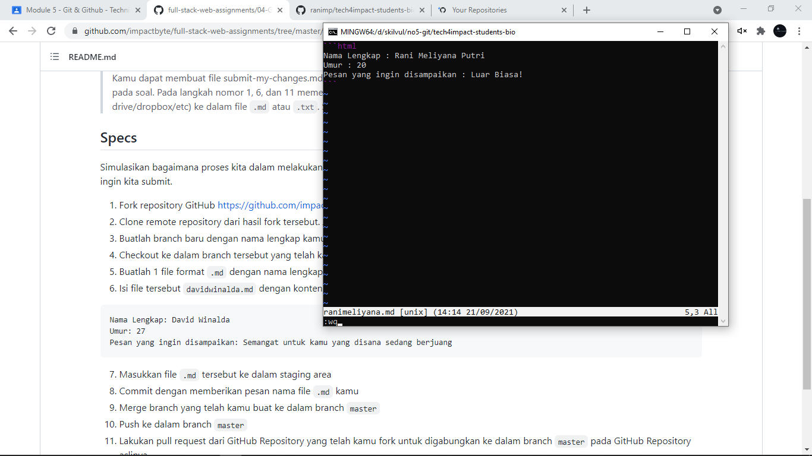

link pull request : https://github.com/impactbyte/tech4impact-students-bio/pull/32

link repository fork dari impactbyte dan perubahan : https://github.com/ranimp/tech4impact-students-bio

Jawaban :
1. Melakukan fork 

2. git clone https://github.com/ranimp/tech4impact-students-bio.git
3. cd tech4impact-students-bio ->
git branch ranimeliyana
4. git checkout ranimeliyana
5. vim ranimeliyana.md
6. mengisi file md

7. git add .
8. git commit -m "adding ranimeliyana.md"
9. git checkout master -> git merge rani-meliyana
10. git push -u origin master
11. melakukan pull request

